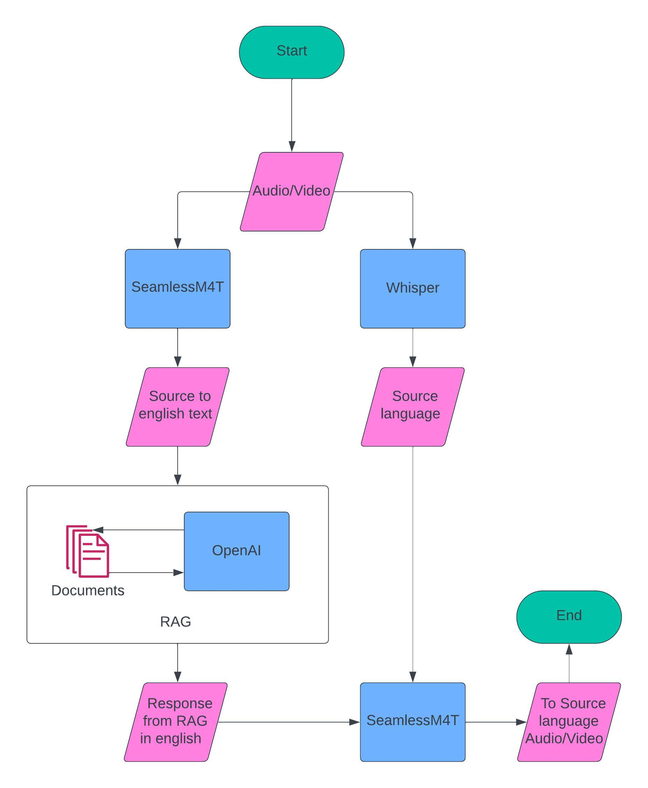

## tensorGo-assignment




> [!NOTE]
> For performing RAG I'm using a paid subscription of openai, please use it for light testing only.


## Instalation

# Step:1 - Environment setup and requirement installation
- clone the repository git clone ```git clone https://github.com/arunchandra23/tensorGo-assignment.git```
- Go to root ```cd tensorGo-assignment```
- Create virtual environments for running `seamlessM4t` and `whisper` and installing requirements
    - For `seamlessM4t`
        - In the root folder: `tensorGo-assignment/` create a virtual environment using ```python -m venv seamlessenv```
        - Activate the environment ```python seamlessenv/Scripts/activate.bat```
        - Run ```pip install -r seamless_requirements.txt```
        - Install ffmpeg as shown [here](https://github.com/openai/whisper#setup)
    - For `whisper`
        - In the folder: `tensorGo-assignment/Whisper-api` create a virtual environment using ```python -m venv whisperenv```
        - Activate the environment ```whisperenv/Scripts/activate.bat```
        - Run ```pip install -r whisper_requirements.txt```

> [!ADVICE]
> Please try to open `tensorGo-assignment/` and `tensorGo-assignment/Whisper-api` in saperate IDE windows for ease of set-up process.


# Step:2 - Running seamlessM4t (API service)
- In the root folder: `tensorGo-assignment/` activate the environment `seamlessenv`
- Run command ```uvicorn seamless_fastapi:app```, takes some time to download and load the model.
- After you see `INFO:    Started server process`, continue to the next step.

# Step:3 - Running whisper (API service)
- In the folder: `tensorGo-assignment/Whisper-api` activate the environment `whisperenv`
- Run command ```uvicorn whisper_fastapi:app --port 8001```, takes some time to download and load the model.
- After you see `INFO:    Started server process`, continue to the next step.

# Step:4 - Running streamlit application
- In the root folder: `tensorGo-assignment/` activate the environment `seamlessenv`
- Run command ```streamlit run app.py```, which opens streamlit at (http://localhost:8501)
- The streamlit app contains two columns:
    - Right column: contains the pdf file from which you can ask questions
    - Left column: Contains the file upload and response section, where the response is in the same language as of audio.
- Upload an audio file size `less than 5MB` 
- Click submit and wait for the response.


## Supported Languages

| Language   |
|------------|
| English    |
| Spanish    |
| French     |
| German     |
| Italian    |
| Hindi      |
| Telugu     |
| Bengali    |
| Malayalam  |
| Tamil      |
| Kannada    |
| Marathi    |
| Arabic     |


# Example question on the pdf that can be asked in any of the supported languages as mentioned
- Who is Narendra modi?
- When was Narendra Modi born?
- Tell me about Narendra modi's childhood?
- When was Narendra modi made prime minister?

